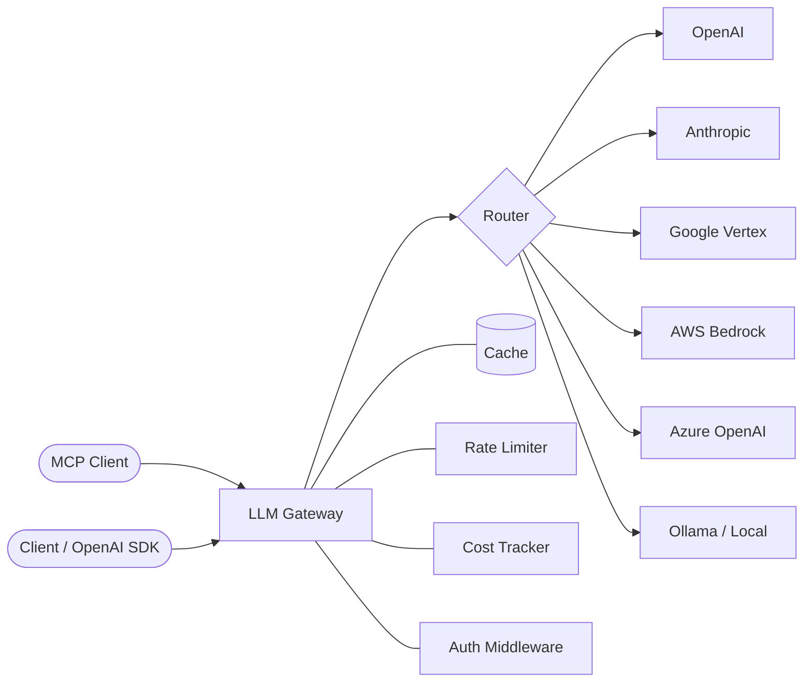

# LLM Gateway

[](LICENSE)
[](https://www.python.org/downloads/)
[](https://fastapi.tiangolo.com)

A unified, OpenAI-compatible API gateway that routes LLM requests across multiple providers with automatic fallback, cost tracking, caching, and rate limiting. Point any OpenAI SDK client at the gateway and transparently access OpenAI, Anthropic, Google, AWS Bedrock, Azure OpenAI, and local models through a single endpoint.

## Architecture



## Features

- **OpenAI-compatible API** -- drop-in replacement for the OpenAI SDK
- **Multi-provider routing** -- OpenAI, Anthropic, Google Vertex, AWS Bedrock, Azure OpenAI, Ollama
- **Model aliasing** -- map friendly names (gpt-4, claude) to specific provider models
- **Automatic fallback** -- configurable fallback chains with ordered provider lists
- **Cost-based routing** -- route to the cheapest provider for a given model
- **Latency-based routing** -- route to the fastest responding provider
- **Response caching** -- Redis-backed cache for non-streaming requests
- **Rate limiting** -- per-key and global request/token rate limits
- **Cost tracking** -- real-time cost calculation from token usage and pricing data
- **API key authentication** -- multi-key auth middleware with public path bypass
- **Streaming support** -- SSE streaming pass-through for chat completions
- **MCP (Model Context Protocol) server** -- expose gateway as tool provider
- **Prometheus metrics** -- built-in /metrics endpoint
- **YAML configuration** -- environment variable interpolation in config files

## Quick Start

### Docker Compose

```bash
git clone https://github.com/yourorg/llm-gateway.git
cd llm-gateway

# Configure your provider keys
cp .env.example .env
# Edit .env with your API keys

docker-compose up -d
```

### Verify

```bash
curl http://localhost:8000/health
# {"status":"ok","version":"0.1.0"}
```

### First Request

```bash
curl http://localhost:8000/v1/chat/completions \
  -H "Content-Type: application/json" \
  -H "Authorization: Bearer your-gateway-key" \
  -d '{
    "model": "gpt-4",
    "messages": [{"role": "user", "content": "Hello!"}],
    "temperature": 0.7
  }'
```

## API Reference

### Health Check

```
GET /health
```

```bash
curl http://localhost:8000/health
```

### List Models

```
GET /v1/models
```

```bash
curl http://localhost:8000/v1/models \
  -H "Authorization: Bearer your-gateway-key"
```

### Chat Completions

```
POST /v1/chat/completions
```

```bash
curl http://localhost:8000/v1/chat/completions \
  -H "Content-Type: application/json" \
  -H "Authorization: Bearer your-gateway-key" \
  -d '{
    "model": "gpt-4",
    "messages": [
      {"role": "system", "content": "You are a helpful assistant."},
      {"role": "user", "content": "Explain quantum computing in one sentence."}
    ],
    "temperature": 0.7,
    "max_tokens": 256
  }'
```

Response:

```json
{
  "id": "chatcmpl-abc123",
  "object": "chat.completion",
  "created": 1700000000,
  "model": "gpt-4o",
  "choices": [
    {
      "index": 0,
      "message": {
        "role": "assistant",
        "content": "Quantum computing uses qubits that can exist in superposition..."
      },
      "finish_reason": "stop"
    }
  ],
  "usage": {
    "prompt_tokens": 25,
    "completion_tokens": 30,
    "total_tokens": 55
  }
}
```

### Streaming

```bash
curl http://localhost:8000/v1/chat/completions \
  -H "Content-Type: application/json" \
  -H "Authorization: Bearer your-gateway-key" \
  -d '{
    "model": "claude",
    "messages": [{"role": "user", "content": "Write a haiku."}],
    "stream": true
  }'
```

### Embeddings

```
POST /v1/embeddings
```

```bash
curl http://localhost:8000/v1/embeddings \
  -H "Content-Type: application/json" \
  -H "Authorization: Bearer your-gateway-key" \
  -d '{
    "model": "text-embedding-3-small",
    "input": ["Hello world", "Goodbye world"]
  }'
```

### Usage Statistics

```
GET /usage
```

```bash
curl http://localhost:8000/usage \
  -H "X-API-Key: your-gateway-key"
```

### MCP Endpoints

| Method | Path | Description |
|--------|------|-------------|
| GET | /mcp/sse | SSE stream for MCP tool discovery |
| POST | /mcp/tools/call | Execute an MCP tool call |
| GET | /mcp/tools | List available MCP tools |

```bash
# List MCP tools
curl http://localhost:8000/mcp/tools

# Call a tool
curl -X POST http://localhost:8000/mcp/tools/call \
  -H "Content-Type: application/json" \
  -d '{"tool": "list_models", "arguments": {}}'

# SSE stream
curl -N http://localhost:8000/mcp/sse
```

## MCP Integration

The gateway exposes an MCP-compatible tool server, allowing AI assistants to use the gateway as a tool provider.

**Available tools:**
- `chat_completion` — Route chat completions through the gateway
- `list_models` — List all available models across providers
- `list_providers` — List configured providers and status
- `get_usage` — Get token usage and cost statistics

**Connect from Claude Desktop or any MCP client:**

```json
{
  "mcpServers": {
    "llm-gateway": {
      "url": "http://localhost:8000/mcp/sse"
    }
  }
}
```

## Provider Configuration

Providers are configured in `config/providers.yaml`. API keys support environment variable interpolation with optional defaults using `${VAR:default}` syntax:

```yaml
providers:
  openai:
    enabled: true
    api_key: "${OPENAI_API_KEY:}"
    api_base: "https://api.openai.com/v1"
    timeout: 60
    max_retries: 3
    models:
      - name: gpt-4o
        enabled: true
        max_tokens: 16384
        context_window: 128000
      - name: gpt-4o-mini
        enabled: true
        max_tokens: 16384
        context_window: 128000

  anthropic:
    enabled: true
    api_key: "${ANTHROPIC_API_KEY:}"
    api_base: "https://api.anthropic.com"
    timeout: 120
    models:
      - name: claude-sonnet-4-20250514
        enabled: true
        max_tokens: 8192
        context_window: 200000

  ollama:
    enabled: false
    api_base: "http://localhost:11434"
    models:
      - name: llama3.1
        enabled: true
```

## Routing Strategies

Configure routing in `config/routing.yaml`:

### Model Mapping

Map friendly aliases to specific provider/model pairs:

```yaml
routing:
  default_provider: openai
  model_mapping:
    gpt-4:
      alias: gpt-4
      provider: openai
      model: gpt-4o
    claude:
      alias: claude
      provider: anthropic
      model: claude-sonnet-4-20250514
    local:
      alias: local
      provider: ollama
      model: llama3.1
```

### Fallback Chains

Define ordered provider lists for automatic failover. When a provider returns a 5xx error or times out, the gateway automatically tries the next provider in the chain:

```yaml
routing:
  fallback_chains:
    high_quality:
      providers:
        - anthropic
        - openai
        - bedrock
    fast:
      providers:
        - openai
        - anthropic
        - ollama
    cost_optimized:
      providers:
        - ollama
        - openai
        - anthropic
```

### Cost-Based Routing

The `CostRouter` scans all enabled providers that support the requested model and selects the one with the lowest combined input + output token rate from the pricing table. Falls back to the default provider when no pricing data is available.

### Latency-Based Routing

The `LatencyBasedBalancer` tracks provider response times and routes requests to the fastest available provider. Combined with fallback chains, this ensures requests go to the lowest-latency provider that is currently healthy.

## Caching

Non-streaming responses are cached using a deterministic SHA-256 hash of the request body. Cache keys are stable across process restarts because the body is serialized with sorted keys.

```yaml
caching:
  enabled: true
  backend: redis
  redis_url: "redis://localhost:6379/0"
  ttl_seconds: 3600
  max_size: 10000
```

- Streaming requests bypass the cache entirely
- Cache hits return an `X-Cache: HIT` response header
- Cache misses return `X-Cache: MISS`
- The route-level cache in `routes.py` also supports in-memory caching when Redis is unavailable

## Cost Tracking

Every request calculates cost from token usage and the pricing table in `src/cost/pricing.py`. Costs are broken down into input and output components:

```python
from src.cost.calculator import CostCalculator
from src.providers.base import UsageStats

calc = CostCalculator()
usage = UsageStats(input_tokens=1000, output_tokens=500, total_tokens=1500)
breakdown = calc.calculate(usage, model="gpt-4o", provider="openai")
# CostBreakdown(input_cost=0.005, output_cost=0.0075, total_cost=0.0125, ...)
```

The pricing table covers OpenAI, Anthropic, Google, and AWS models. Unknown models return zero cost rather than raising errors.

## Drop-in Replacement

Point the OpenAI Python SDK at the gateway with zero code changes:

```python
from openai import OpenAI

client = OpenAI(
    base_url="http://localhost:8000/v1",
    api_key="your-gateway-key",
)

response = client.chat.completions.create(
    model="gpt-4",
    messages=[{"role": "user", "content": "Hello!"}],
    temperature=0.7,
)

print(response.choices[0].message.content)
```

Embeddings work the same way:

```python
embeddings = client.embeddings.create(
    model="text-embedding-3-small",
    input=["Hello world"],
)
```

Streaming:

```python
stream = client.chat.completions.create(
    model="claude",
    messages=[{"role": "user", "content": "Tell me a story."}],
    stream=True,
)

for chunk in stream:
    if chunk.choices[0].delta.content:
        print(chunk.choices[0].delta.content, end="")
```

## Production Deployment

### Environment Variables

| Variable | Description |
|----------|-------------|
| `OPENAI_API_KEY` | OpenAI API key |
| `ANTHROPIC_API_KEY` | Anthropic API key |
| `AZURE_OPENAI_API_KEY` | Azure OpenAI API key |
| `AZURE_OPENAI_ENDPOINT` | Azure OpenAI endpoint URL |
| `AZURE_OPENAI_DEPLOYMENT` | Azure OpenAI deployment name |
| `AWS_REGION` | AWS region for Bedrock (default: us-east-1) |
| `GCP_PROJECT_ID` | Google Cloud project ID |
| `GCP_REGION` | Google Cloud region (default: us-central1) |
| `GATEWAY_API_KEYS` | Comma-separated list of valid gateway API keys |

### Running with Uvicorn

```bash
uvicorn src.main:app --host 0.0.0.0 --port 8000 --workers 4
```

### Docker

```dockerfile
FROM python:3.11-slim
WORKDIR /app
COPY requirements.txt .
RUN pip install --no-cache-dir -r requirements.txt
COPY . .
CMD ["uvicorn", "src.main:app", "--host", "0.0.0.0", "--port", "8000", "--workers", "4"]
```

### Recommended Setup

- Run behind a reverse proxy (nginx, Caddy, Traefik)
- Enable Redis for caching and rate limiting
- Set `GATEWAY_API_KEYS` for authentication
- Monitor with structured logging (structlog outputs JSON in production)
- Scrape `/metrics` endpoint with Prometheus
- Set appropriate timeouts per provider in `config/providers.yaml`
- Use fallback chains for high-availability workloads

## Project Structure

```
llm-gateway/
+-- config/
|   +-- config.yaml              # Server settings
|   +-- providers.yaml           # Provider configurations
|   +-- routing.yaml             # Routing rules, caching, rate limits
+-- src/
|   +-- __init__.py
|   +-- main.py                  # FastAPI app entry-point
|   +-- api/
|   |   +-- models.py            # Pydantic request/response models
|   |   +-- routes.py            # FastAPI route handlers
|   |   +-- dependencies.py      # Dependency injection
|   +-- core/
|   |   +-- config.py            # YAML config loading with env var interpolation
|   |   +-- exceptions.py        # Exception hierarchy
|   |   +-- cache.py             # In-memory / Redis cache backend
|   |   +-- rate_limiter.py      # Rate limiting logic
|   |   +-- tracker.py           # Usage tracking
|   +-- cost/
|   |   +-- calculator.py        # Cost calculation engine
|   |   +-- pricing.py           # Per-model pricing table
|   |   +-- tracker.py           # Cost tracking persistence
|   +-- middleware/
|   |   +-- auth.py              # API key authentication
|   |   +-- cache.py             # Response caching middleware
|   |   +-- logging_mw.py        # Request logging
|   |   +-- metrics.py           # Prometheus metrics
|   |   +-- rate_limit.py        # Rate limit middleware
|   +-- providers/
|   |   +-- base.py              # Abstract provider interface
|   |   +-- registry.py          # Provider registry (singleton)
|   |   +-- openai_provider.py   # OpenAI implementation
|   |   +-- anthropic_provider.py# Anthropic implementation
|   |   +-- azure_provider.py    # Azure OpenAI implementation
|   |   +-- bedrock_provider.py  # AWS Bedrock implementation
|   |   +-- vertex_provider.py   # Google Vertex AI implementation
|   |   +-- ollama_provider.py   # Ollama (local) implementation
|   +-- mcp/
|   |   +-- server.py              # MCP server setup
|   |   +-- transport.py           # SSE transport layer
|   |   +-- routes.py              # MCP route handlers
|   +-- routing/
|       +-- router.py            # Request router with model mapping
|       +-- fallback.py          # Fallback chain executor
|       +-- cost_router.py       # Cost-optimized provider selection
|       +-- load_balancer.py     # Round-robin, latency, cost balancers
+-- tests/
    +-- conftest.py              # Shared fixtures
    +-- test_api.py              # API integration tests
    +-- test_middleware/
    |   +-- test_auth.py         # Auth middleware tests
    |   +-- test_cache.py        # Cache middleware tests
    +-- test_providers/
    |   +-- test_registry.py     # Provider registry tests
    +-- test_routing/
        +-- test_router.py       # Router tests
        +-- test_cost_router.py  # Cost-based routing tests
```

## License

MIT
